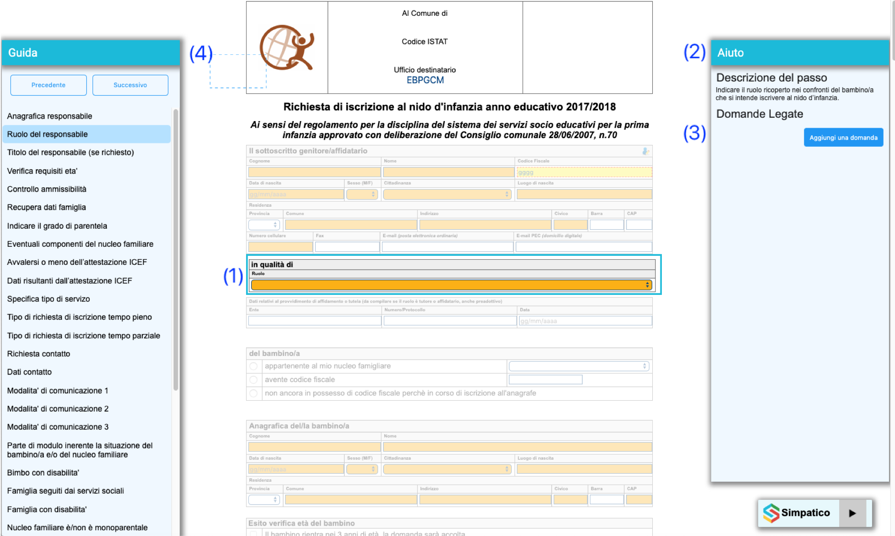
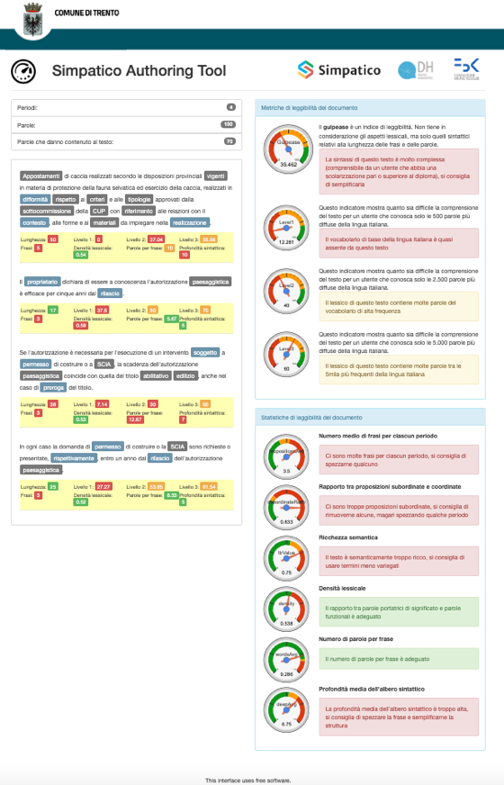

[](https://travis-ci.org/SPRINT-Project/simpatico-adaptation-engines)

[](https://codecov.io/gh/SPRINT-Project/simpatico-adaptation-engines)

# SPRINT - Strumenti di semplificazione


Strumenti di semplificazione e di supporto all'interazione dei servizi online.

# Descrizione

Il progetto SPRINT intende valorizzare alcuni risultati del progetto SIMPATICO (https://www.simpatico-project.eu/) volti a migliorare e semplificare l’interazione tra cittadino e servizi online. L’obiettivo del progetto è di creare un kit che permetta una facile integrazione di alcune funzioni avanzate di SIMPATICO in un generico portale della Pubblica Amministrazione e/o in un servizio online. 

L'Adaptation Engine, che fa parte della famiglia di tools messa in riuso, e' il componente che implementa le fuzioni di adattamento del testo, di adattamento del workflow e supporto alla misura della complessita' di un testo. Per fare questo utilizza i sotto componeni Wrokflow Adaptatione Engine (WAE), Text Adaptation Engine (TAE) e Autoring Supporting Tool (AST). 

Questa breve note intende evidenziare le funzionalita' messe a disposizione dal tool lato utente finale. La descrizione completa e tecnica di utilizzo dei diversi componenti si trova nel documento [di progetto](dic/BP-OR-AP-06_v1.0.pdf)

## Waokflow Adaptation Engine (WAE)

Il Workflow Adaptation Engine è responsabile di adattare e semplificare l’interazione con gli e-service. Una volta individuati i diversi blocchi interattivi dell’e-service, consente di modificarne e semplificarne il flusso di compilazione. Il WAE permette di: 
 * suddividere l'e-service (template HTML) in blocchi di interazione e presentare gli stessi all'utente in base alle dipendenze tra essi ed allo stato della compilazione (vedi (1) in figura).
 * presentare all'utente una sezione di suggerimenti vicino a ciascun blocco di interazione per fare capire meglio cosa inserire nei diversi campi (vedi (12) in figura).
 * presentare all'utente una sezione dove vengono presentate le domande e risposte presenti nel modulo QAE relative al blocco selezionato (vedi (3) in figura).
 * presentare all'utente una sezione che visualizza l’insieme dei blocchi interattivi da cui è composto il servizio online (vedi (4) in figura).

 

Per applicare la workflow adaptation ad un e-service occorre quindi marcare i blocchi interattivi all’interno del documento digitale e codificare le dipendenze tra gli stessi in un Workflow Adaptation Model. Quando attivato, il WAE recupera le informazioni dal Workflow Adaptation Model, estrae i vari blocchi interattivi e applica le regole di esecuzione/dipendenza.

## Text Adaptation Engine (TAE)

Il Text Adaptation Engine permette di adattare/modificare il testo per migliorarne leggibilità e comprensione. 

In particolare TAE permette di: 
 * dato una parola consente di arricchirla con informazioni atte a migliorarne la comprensione;

 

 * data una frase consente di rivederla nella forma per renderla più leggibile e comprensibile.

  

## Authoring Support Tool (AST)

L’ Authoring Supporting Tool mette a disposizione un insieme di strumenti per misurare il livello di leggibilità di un testo descrittivo. La versione sperimentata permette all’utente finale inserisce un testo libero in una pagina web predefinita e di avere in risposta vari indici e suggerimenti che permettono di migliorare la leggibilità del testo. 

In Particolare AST fornisce agli operatori della PA l'analisi e il supporto decisionale in merito al contenuto del servizio elettronico. In particolare, questo include
 * analisi dei testi descrittivi del servizio elettronico e della loro complessità utilizzando la funzionalità TAE;
 * identificazione degli elementi critici del testo e possibili semplificazioni lessicali e sintattiche.

 Un esempio di risultato dell'analisi dei un testo e' presentato nella figura seguente.

  

Questo tool è particolarmente importante come strumento di supporto alla scrittura delle descrizioni dei servizi online. 
La descrizione completa delle metriche usate è raggiungibile all’indirizzo:

    https://github.com/SPRINT-Project/adaptation-engines/wiki/AST

## Altri riferimenti

Per maggiori informazioni è possibile consultare:
 * documento [di progetto](dic/BP-OR-AP-06_v1.0.pdf)

## Product status

Il prodotto è stabile e production ready e usato in produzione dal Comune di Trento. Lo sviluppo avviene sia su richiesta degli Enti utilizzatori, sia su iniziativa autonoma del maintainer.

## Struttura del repository

Il repository è organizzato con una struttura di directory tipica dei progetti Java Apache Maven.
 * Nella directory src/main/resources/static/wae sono presenti alcuni esempi di utilizzo del Waorkflow Adaptation Engine direttamente eseguibili
 * Nella directory src/main/resources/static/tae sono presenti alcuni esempi di utilizzo del Text Adaptation Engine direttamente eseguibili
 * Nella directory doc e' presente la documentazione del progetto SPRINT
 * Il file src/main/resources/static/tae/webdemo/index-tn.html rappresenta un esempio di utilizzo di AST


## Copyright:
  license: Apache-2.0
  mainCopyrightOwner: 'Smart Community Lab, FBK and Comune di Trento'
  repoOwner: 'Smart Community Lab, FBK and Comune di Trento'

## Soggetti incaricati del mantenimento
  name: Marco Pistore
  email: pistore@fbk.eu
  affiliation: Fondazione Bruno Kessler

## Segnalazioni di sicurezza
Le segnalazioni di sicurezza vanno inviate all'indirizzo pistore@fbk.eu

## Prerequisiti e dipendenze

Il server TAE dipende dai tool [Tint](http://tint.fbk.eu/) e [FBK utils](https://github.com/fbk/utils).
TAE e WAE sono forniscono delle API e dei servizi di back-end che devono essere richiamati in modo nativo da un sistema ospite (es. portale dei servizi della PA). Per semplificare l'integrazione e' stato sviluppato l'Interactive Front-End (IFE). Un versione verticalizzata dell'IFE e' stata rilasciata per il progetto SPRINT ed e' presente nel repository del Comune di Trento.


# Technical Documentation

## Requirements


The following should be installed in order to execute the engines:

    1. Java 8
    2. MongoDB 
    
## Installation without docker

### Configuration


The engine configuration relies on a series of configuration properties deriving from Spring Boot properties and
the specific engine properties. It is possible to pass the properties either as execution parameters (`-D<propertyname>=<propertyvalue>`) or defining them in the `src/main/resources/application.properties`. 
The following properties are relevant:

  - `server.port`: Defines the HTTP port where the engines will listen   
  - `server.contextPath`: the engine context path used for the exposed endpoint (simp-engines)
  - `spring.data.mongodb.uri`: URL of the MongoDB data base (e.g., `mongodb://localhost:27017/waedb`)
  - `tae.mode.proxy.enabled`: defines whether the instance works as a proxy to a remote Text Adaptation Engine API
  or implements the functionality internally. The TAE functionality is resource consuming; if the engine works 
  in test mode or does not require instantiating this functionality set this value to true.
  - `tae.mode.proxy.endpoint`: Endpoint of the remote TAE instance. Required in case of proxy mode is enabled.

### Build and run

The engine runtime is implemented as a Spring Boot standalone application and can be built with Apache Maven.
To accomplish this, execute (within the project directory)

<code>
./mvnw package
</code>      
       
This produces the executable jar in `target` folder. To execute the engine use the following command:

<code>
java -jar target/simpatico-adaptation-engines-0.0.1-SNAPSHOT.jar
</code>       
         
## Installation with docker

### Configuration

Configure properties in file `docker-configs/app.env`

### Build and run

From the root of the project: 

* Try the system executing `docker-compose up`
* Run as a daemon executing `docker-compose start`
* Stop the daemon executing `docker-compose stop`


## Documentation

The WAE workflow model and its usage is described [here](doc/wae-model.docx)

The API exposes the Swagger documentation at the following endpoints
  - `<context-path>/apidocs`: The raw swagger 2 API definition
  - `<context-path>/swagger-ui.html`: The Swagger UI interface of the component

To run the multi-language environment, you need to implement two steps:
- Install the [Simpatico TAE server](https://github.com/SIMPATICOProject/SimpaticoTAEServer) for lexical and syntactic simplification.
- Edit the configuration file and add the `lex.server` and `lex.port` settings in `src/main/resources/simpatico-default.props` so that they point to the correct information.

## Requirements

The TAE server needs the last version of [Tint](http://tint.fbk.eu/) and [FBK utils](https://github.com/fbk/utils) installed.

Run these commands:
```
git clone https://github.com/dhfbk/tint
cd tint
git checkout corenlp370
mvn clean install
cd ..
git clone https://github.com/fbk/utils
cd utils
git checkout develop
mvn clean install
```
