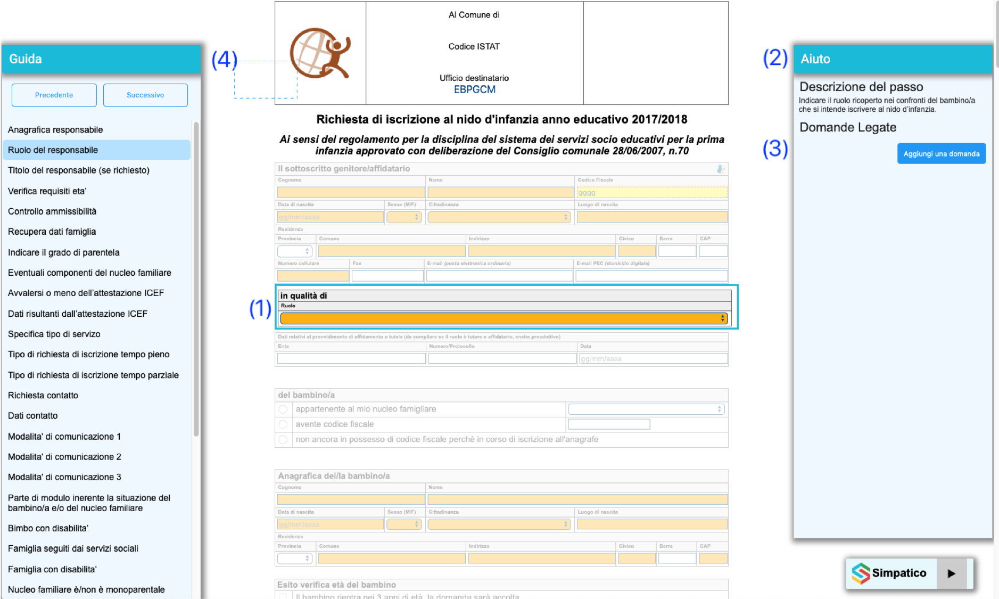
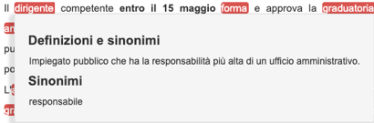
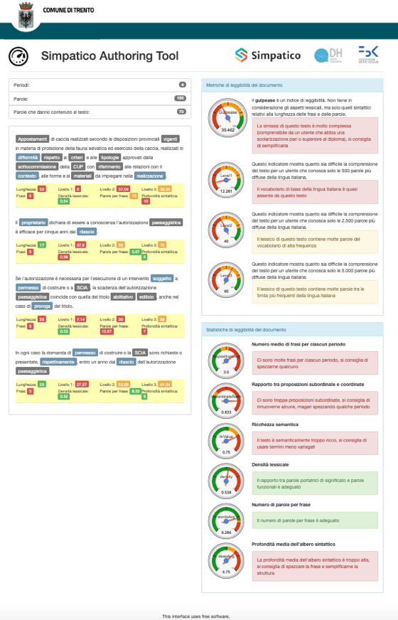

## Guida all'autilizzo del tool
L'Adaptation Engine e' il componente che implementa le fuzioni di adattamento del testo, di adattamento del workflow e supporto alla misura della complessita' di un testo. Per fare questo utilizza i sotto componeni Wroekflow Adaptatione Engine (WAE), Text Adaptation Engine (TAE) e Autoring Supporting Tool (AST). La descrizione completa e tecnica di utilizzo dei diversi componenti si trova nel documento BP-OR-AP-06_v1.0.

Questa breve note intende evidenziare le funzionalita' messe a disposizione dal tool lato utente finale. 

### Waokflow Adaptation Engine (WAE)
Il Workflow Adaptation Engine è responsabile di adattare e semplificare l’interazione con gli e-service. Una volta individuati i diversi blocchi interattivi dell’e-service, consente di modificarne e semplificarne il flusso di compilazione. Il WAE permette di: 
 * suddividere l'e-service (template HTML) in blocchi di interazione e presentare gli stessi all'utente in base alle dipendenze tra essi ed allo stato della compilazione (vedi (1) in figura).
 * presentare all'utente una sezione di suggerimenti vicino a ciascun blocco di interazione per fare capire meglio cosa inserire nei diversi campi (vedi (12) in figura).
 * presentare all'utente una sezione dove vengono presentate le domande e risposte presenti nel modulo QAE relative al blocco selezionato (vedi (3) in figura).
 * presentare all'utente una sezione che visualizza l’insieme dei blocchi interattivi da cui è composto il servizio online (vedi (4) in figura).

 

Per applicare la workflow adaptation ad un e-service occorre quindi marcare i blocchi interattivi all’interno del documento digitale e codificare le dipendenze tra gli stessi in un Workflow Adaptation Model. Quando attivato, il WAE recupera le informazioni dal Workflow Adaptation Model, estrae i vari blocchi interattivi e applica le regole di esecuzione/dipendenza.

### Text Adaptation Engine (TAE)
Il Text Adaptation Engine permette di adattare/modificare il testo per migliorarne leggibilità e comprensione. 

In particolare TAE permette di: 
 * dato una parola consente di arricchirla con informazioni atte a migliorarne la comprensione;

 

 * data una frase consente di rivederla nella forma per renderla più leggibile e comprensibile.

  

### Authoring Support Tool (AST)
L’ Authoring Supporting Tool mette a disposizione un insieme di strumenti per misurare il livello di leggibilità di un testo descrittivo. La versione sperimentata permette all’utente finale inserisce un testo libero in una pagina web predefinita e di avere in risposta vari indici e suggerimenti che permettono di migliorare la leggibilità del testo. 

In Particolare AST fornisce agli operatori della PA l'analisi e il supporto decisionale in merito al contenuto del servizio elettronico. In particolare, questo include
 * analisi dei testi descrittivi del servizio elettronico e della loro complessità utilizzando la funzionalità TAE;
 * identificazione degli elementi critici del testo e possibili semplificazioni lessicali e sintattiche.

 Un esempio di risultato dell'analisi dei un testo e' presentato nella figura seguente.

  

Questo tool è particolarmente importante come strumento di supporto alla scrittura delle descrizioni dei servizi online. 
La descrizione completa delle metriche usate è raggiungibile all’indirizzo:

    https://github.com/SPRINT-Project/adaptation-engines/wiki/AST

